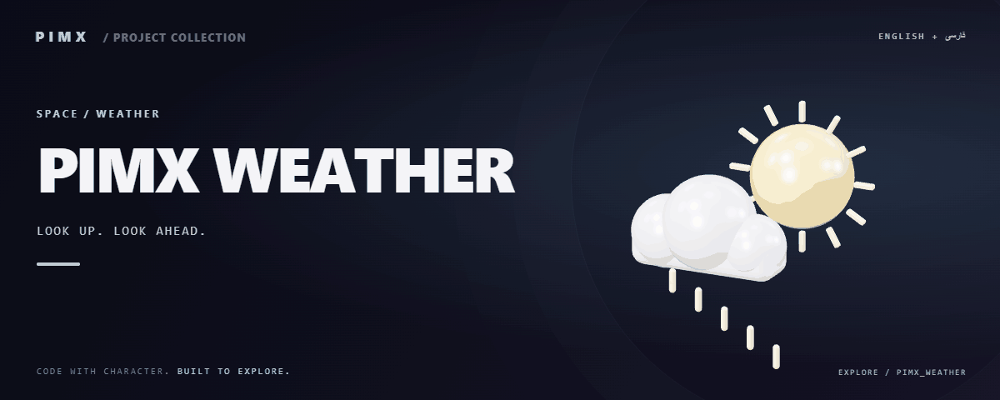

<div align="center">



**[English](README.md) · [فارسی](README.fa.md)**

</div>

<div dir="rtl">

# 🌤️ PIMX WEATHER

<!-- pimx-live-site:start -->
## وب‌سایت آنلاین

**[مشاهدهٔ PIMX_WEATHER ↗](https://pimx-weather.pages.dev/)**
<!-- pimx-live-site:end -->

داشبورد آب‌وهوا با JavaScript ساده، پیش‌بینی، چندزبانه‌بودن، استایل متحرک و نمایش‌های نجومی و خورشیدی.

[GitHub](https://github.com/MOHAMMADREZAABEDINPOOR/PIMX_WEATHER) · [PIMX / Profile](https://github.com/MOHAMMADREZAABEDINPOOR) · [بنر ثابت](assets/readme/hero.png)

| نمای کلی | جزئیات |
|:---|:---|
| 🌤️ تجربه | برنامه وب / تجربه مرورگری |
| 🧰 فناوری | `HTML / CSS / JavaScript` |
| 🌐 زبان راهنما | [English](README.md) · [فارسی](README.fa.md) |

[✨ امکانات](#امکانات) · [🚀 شروع کار](#شروع-کار) · [⚙️ تنظیمات](#تنظیمات) · [🌍 استقرار](#استقرار)

---

<a id="امکانات"></a>

## ✨ امکانات

| بخش | قابلیت موجود |
|:---|:---|
| ⚡ روند کار | آب‌وهوای فعلی و اطلاعات پیش‌بینی |
| 🌐 تجربه کاربری | رابط فارسی و انگلیسی از i18n.js |
| 🛰️ فضا | نمایش‌های نجومی و حرکت خورشید |
| ⚡ روند کار | استقرار استاتیک بدون ابزار ساخت فرانت‌اند |

<a id="پشته-فنی"></a>

## 🧰 پشته فنی

| ابزار | نسخه یا منبع |
|---|---|
| HTML / CSS / JavaScript | `static files` |

<a id="شروع-کار"></a>

## 🚀 شروع کار

مرورگر جدید؛ Python فقط برای سرور HTTP محلی اختیاری است.

<div dir="ltr">

```bash
git clone https://github.com/MOHAMMADREZAABEDINPOOR/PIMX_WEATHER.git
cd PIMX_WEATHER

python -m http.server 8000
```

</div>

<a id="تنظیمات"></a>

## ⚙️ تنظیمات

فایل محیط استاندارد تعریف نشده است. برای تمرین‌های مستقل تنظیم خارجی لازم نیست؛ اگر در کد ثابت‌های سرویس یا مسیر وجود دارد، آن‌ها را پیش از اجرا بررسی کنید.

<a id="استفاده"></a>

## 🎯 استفاده

پوشه را سرو کنید، موقعیت را انتخاب و پنل‌های هوا را ببینید. موقعیت جغرافیایی را فقط برای ویژگی مکان فعلی فعال کنید.

<a id="ساختار-پروژه"></a>

## 🗂️ ساختار پروژه

| مسیر | نقش |
|---|---|
| [`assets/`](assets/) | فایل برند، رسانه و README |
| [`index.html`](index.html) | فایل ورودی یا تنظیم پروژه |

<a id="فرمان‌ها-و-بررسی"></a>

## 🧪 فرمان‌ها و بررسی

فرمان آزمون خودکار در manifest تعریف نشده است. اجرای محلی و بررسی رفتار نمونه را انجام دهید.

<a id="استقرار"></a>

## 🌍 استقرار

پوشه را روی میزبان استاتیک دارای HTTPS منتشر کنید؛ مسیر فایل و لینک‌های بیرونی را بررسی کنید.

<a id="محدودیت‌ها"></a>

## 📌 محدودیت‌ها

پیش‌بینی به سرویس داده بیرونی وابسته است و مشاهده قطعی هوا نیست. مجوز مکان، محدودیت سرویس و شبکه بر نتیجه اثر می‌گذارند.

<a id="رفع-مشکل"></a>

## 🛠️ رفع مشکل

- پکیج غایب: وابستگی را با مدیر پکیج پروژه نصب کنید.
- خطای API یا شبکه: آدرس، سرویس و اتصال میزبانی را بررسی کنید.
- فایل قدیمی: در صورت وجود اسکریپت ساخت، build و کش مرورگر را تازه کنید.

<a id="مشارکت"></a>

## 🤝 مشارکت

برای تغییر، شاخه مستقل بسازید، رفتار فعلی را بررسی کنید و توضیح روشن همراه تغییر بفرستید. اطلاعات خصوصی، خروجی build و دیتابیس محلی را commit نکنید.

<a id="مجوز"></a>

## 📄 مجوز

فایل مجوز در این نسخه موجود نیست. نمایش عمومی کد به‌تنهایی مجوز استفاده مجدد نیست؛ برای شرایط استفاده با مالک مخزن هماهنگ کنید.

---

ساخته‌شده در مجموعه **PIMX** · مستندات فارسی و انگلیسی.

---

<div align="center">

🌤️ **PIMX WEATHER** · [English](README.md) · [فارسی](README.fa.md)

</div>

</div>
